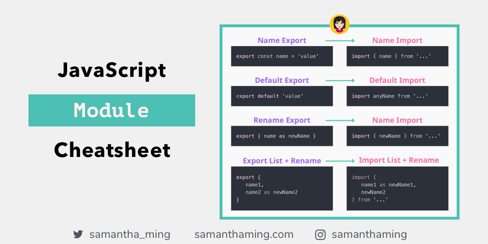

# Что такое Module в JS ? 

## Модуль в JavaScript — это файл, в котором хранится код для выполнения определенной задачи. В модуле могут быть свои переменные, функции, классы и так далее.

## Современные браузеры поддерживают функциональность модулей, что позволяет разделять программы на отдельные модули, которые можно импортировать по мере необходимости. Это удобно, так как позволяет оптимизировать загрузку модулей и обрабатывать их на стороне клиента.

...

# Как это работает?
## Модули в JavaScript обеспечивают организацию кода, разделяя его на отдельные файлы. Вот как это происходит:

## Создание модуля: Вы создаете файл с расширением .js, например, myModule.js. Внутри этого файла вы определяете переменные, функции, классы и другие элементы, которые хотите использовать в других частях вашего приложения.

## Экспорт: В модуле вы используете ключевое слово export, чтобы сделать определенные элементы доступными для импорта из других файлов. Например:

```js
export {getData};
```

## Импорт: В другом файле (например, main.js) вы используете ключевое слово import, чтобы получить доступ к экспортированным элементам:

```js
import {getData} from './api.js,;
getData();
```

## Загрузка модулей: Браузер автоматически загружает модули, когда они импортируются в вашем коде. Вы можете использовать атрибут type="module" в теге <script> для указания, что файл является модулем:

```js
<!-- index.html -->
<script type="module" src="app.js"></script>

```